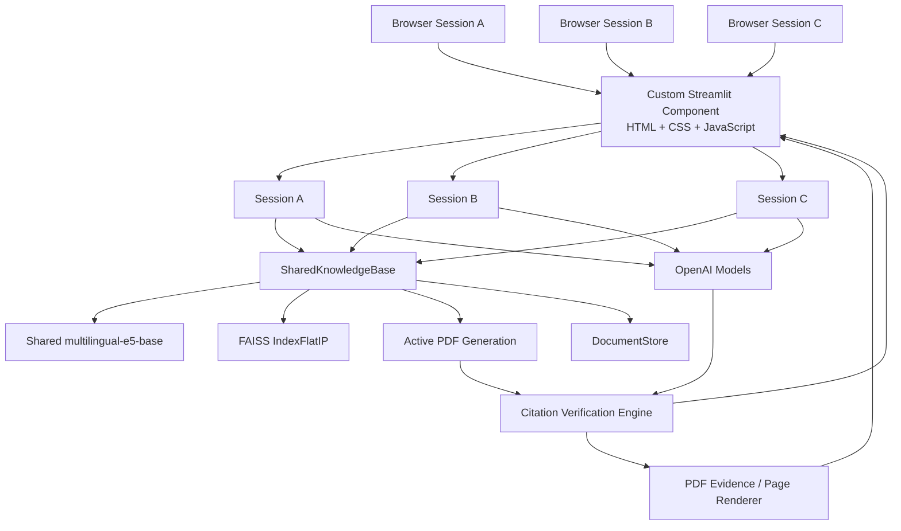

# Research Studio
## Verified RAG, Source-Grounded Answers, and Interactive PDF Intelligence

> A production-oriented document intelligence system built around hierarchical RAG, multilingual semantic retrieval, verified sentence-level citations, real PDF evidence mapping, multi-user shared knowledge, streaming generation, and a custom Streamlit interface.

Research Studio is not a conventional "upload a PDF and ask questions" demo.

It combines a **hierarchical retrieval engine**, a **shared multi-user knowledge base**, a **citation verification pipeline**, a **real PDF evidence viewer**, a **streaming transport layer**, and a **custom browser UI** into a single application. The goal is to make document-grounded AI answers not only useful, but also **inspectable, traceable, responsive, and resistant to misleading source attribution**.

The project started as a simpler Parent–Child RAG assistant and evolved into a much larger research interface with explicit state management, source lifecycle handling, concurrency controls, incremental synchronization, verified inline citations, and low-latency UI behavior.

---

## Highlights

- **Hierarchical Parent–Child RAG**
  - Small child chunks are used for precise vector retrieval.
  - Larger parent chunks are sent to the language model to preserve context.
  - Current index format is based on approximately **1000-character parent chunks** and **250-character child chunks**.

- **Multilingual semantic retrieval**
  - Uses `intfloat/multilingual-e5-base` through Sentence Transformers.
  - Uses FAISS `IndexFlatIP` for normalized inner-product / cosine-style retrieval.
  - One shared E5 model is reused across the server process.

- **Two answer paths**
  - **GPT-4o-mini** for a lightweight document-focused path.
  - **GPT-5.6 Luna** through the Responses API with optional built-in web search.
  - Response detail controls influence verbosity and reasoning configuration.

- **Verified inline citations**
  - Model-produced citation metadata is treated as a candidate, not as trusted truth.
  - Claims, quotes, parent IDs, table rows, values, dates, conditions, and real PDF locations are checked before a citation is accepted.
  - Ambiguous evidence is rejected instead of being force-matched.

- **Real PDF evidence viewer**
  - Opens the actual rendered PDF page.
  - Highlights a quote only when its location can be resolved safely.
  - Avoids broad or misleading highlights when exact evidence cannot be verified.
  - Includes document navigation, section mapping, and used-section indicators.

- **Answer → Source spatial interaction**
  - Source exploration is integrated into the answer rather than treated as a detached reference list.
  - Source panels use shared-element / liquid-style transitions.
  - Inline citation focus can move directly to the corresponding PDF evidence.

- **Shared multi-user knowledge base**
  - All browser sessions can use one shared active PDF / FAISS index.
  - Chat history, runtime state, photos, and UI state remain session-specific.
  - New document generations are swapped atomically.
  - In-flight chats can continue using the generation they started with.

- **Streaming-first architecture**
  - Optimistic local rendering before server acknowledgement.
  - Incremental snapshots instead of retransmitting the entire application state.
  - Runtime patches, row patches, document references, and command acknowledgements.
  - Streaming Markdown rendering with sanitized block reuse.

- **Low-latency citation lifecycle**
  - Source lists can become available before expensive sentence/PDF citation finalization finishes.
  - Inline citation DOM work is deferred and cooperatively processed in small browser-time budgets.
  - Out-of-order runtime updates are guarded against stale state regression.

- **Developer telemetry**
  - Retrieval latency.
  - Embedding latency.
  - First-token latency.
  - Total request time.
  - Retrieved parent scores.
  - Token / cost diagnostics.
  - Web-search activity.
  - Citation diagnostics and source coverage.

---

# 1. Why This Project Exists

Most small RAG applications follow a straightforward pipeline:

```text
PDF
  → chunk text
  → create embeddings
  → vector search
  → send retrieved text to an LLM
  → display the answer
```

That is useful, but it leaves several difficult questions unanswered:

- Did the model actually use the source it claims to use?
- Does the cited quote exist in the selected parent chunk?
- Does it exist on the real PDF page?
- Is the match unique, or does the same phrase appear multiple times?
- Does a number, date, field, price, or condition in the answer conflict with the evidence?
- Can a table value be accidentally attached to a different row with the same number?
- What happens if the PDF is replaced while another user is still generating an answer?
- What happens if a browser command is delivered but the acknowledgement is lost?
- How do you avoid duplicating an API call after an uncertain timeout?
- How do you stream a long answer without repeatedly rebuilding the entire DOM?
- How do you show sources quickly without waiting for expensive PDF-coordinate verification?
- How do you keep a shared embedding model from being loaded once per user?
- How do you preserve responsiveness when multiple sessions are active?

Research Studio is an attempt to solve these problems as part of the application architecture rather than leaving them as edge cases.

---

# 2. System Architecture



The architecture intentionally separates **shared document state** from **per-browser conversational state**.

### Shared across users

- Active PDF
- FAISS index
- Parent / child mappings
- PDF source metadata
- Shared E5 model
- Persistent index package
- Document generation lifecycle

### Isolated per browser session

- Conversation history
- Runtime telemetry
- Current request / cancellation state
- Photos
- UI row state
- Token / request diagnostics
- Temporary files
- Per-request model namespace

This allows many users to ask independent questions while sharing one active document context.

---

# 3. Hierarchical RAG Pipeline

Research Studio uses a **Parent–Child retrieval strategy**.

The goal is to combine:

- **small retrieval units** for search precision, and
- **larger context units** for coherent language-model input.

```text
PDF
 │
 ├─ Parent chunk 0  ───────────────┐
 │    ├─ Child 0                   │
 │    ├─ Child 1                   │
 │    ├─ Child 2                   │
 │    └─ ...                       │
 │                                 │
 ├─ Parent chunk 1                 │
 │    ├─ Child 0                   │
 │    ├─ Child 1                   │
 │    └─ ...                       │
 │                                 │
 └─ ...                            │
                                   ▼
                    child embeddings + FAISS
                                   │
                         semantic similarity
                                   │
                         unique parent IDs
                                   │
                                   ▼
                       larger parent context
                                   │
                                   ▼
                                LLM
```

## Retrieval sequence

1. The PDF is extracted and segmented.
2. Larger parent passages are created.
3. Each parent is divided into smaller child chunks.
4. Child chunks are embedded with multilingual E5.
5. Embeddings are stored in FAISS.
6. A user query is embedded with the same model.
7. The most relevant child vectors are retrieved.
8. Child hits are mapped back to their parent passages.
9. Duplicate parent IDs are removed.
10. The selected parent passages become the model's document context.
11. The generated answer is processed by the source and citation pipeline.

This approach avoids forcing the system to choose between retrieval precision and context size.

---

# 4. Multilingual E5 + FAISS Retrieval

The application uses:

```text
Sentence Transformers
        │
        ▼
intfloat/multilingual-e5-base
        │
        ▼
normalized embeddings
        │
        ▼
FAISS IndexFlatIP
```

The E5 model is loaded **once per server process**, not once per browser session.

That matters in a multi-user deployment because loading a transformer independently for every visitor would be unnecessarily expensive in both RAM and startup time.

The embedding layer also includes:

- bounded batching,
- cancellation checks,
- shared access coordination,
- reusable embedding dimension detection,
- preallocated NumPy output buffers,
- ingestion progress reporting.

For large ingestion jobs, batches are written into a preallocated result matrix instead of collecting every batch in a second large temporary structure and concatenating later.

---

# 5. Shared Knowledge Base and Immutable Document Generations

One of the most important architectural changes from the original project is the introduction of a process-wide `SharedKnowledgeBase`.

A PDF update is not treated as a simple mutation of a global dictionary.

Instead, the system creates a **new document/index generation** and activates it only after the new generation is ready.

Conceptually:

```text
Generation A
PDF A + FAISS A
   │
   ├── Chat 1 lease
   └── Chat 2 lease

New PDF uploaded
   │
   ▼

Generation B is built separately
   │
   ▼

Generation B becomes active atomically
   │
   ├── New Chat 3 → B
   └── New Chat 4 → B

Generation A becomes retired
   │
   └── remains alive until Chat 1 and Chat 2 release it
```

This prevents an active answer from suddenly reading half of one document generation and half of another.

## Lease / reference-count behavior

Each chat request:

1. acquires the currently active namespace,
2. increments its lease count,
3. performs retrieval and generation against that fixed namespace,
4. releases the namespace when the request finishes.

If a generation has already been replaced, it is only physically cleaned up after its final active lease is released.

This makes document replacement safer for concurrent users.

---

# 6. Global Document Mode

The currently active document is intentionally shared across sessions.

When a user uploads a new PDF:

```text
upload
  → validation
  → extraction
  → chunking
  → embedding
  → FAISS construction
  → PDF metadata / viewer mapping
  → persistent package
  → atomic activation
```

After activation, new sessions and new questions use the updated global document.

This is a deliberate behavior of the current application.

The chat itself is still private to each browser session; only the active knowledge base is shared.

---

# 7. Dual Model Paths

Research Studio currently exposes two main answer paths.

## GPT-4o-mini

Used as a lighter document-oriented model path.

The application supports real streaming responses and usage accounting for this route.

It is also used internally for selected summarization / memory operations.

## GPT-5.6 Luna

Used through the Responses API.

This path can use:

```text
web_search
```

when additional current information is needed.

The application tracks real web-search call events during streaming and reports them in runtime telemetry rather than inferring web usage from answer text.

---

# 8. Response Detail Controls

The interface supports multiple answer-detail levels.

The selected level can influence:

- response verbosity,
- reasoning configuration,
- target answer detail,
- runtime diagnostics.

This is not implemented as a purely visual setting; the selected mode is forwarded into the model request configuration.

---

# 9. Conversation Memory

Conversation memory is session-specific.

The application can retain recent conversation turns and currently exposes two memory behaviors:

### Standard memory

Long assistant responses may be summarized before being reused as context.

This reduces repeated context size.

### Advanced memory

Recent content can be forwarded without the same summarization step.

The current UI keeps the recent conversation window bounded rather than allowing unbounded conversation context to grow forever.

---

# 10. Streaming Runtime

Generation is designed as a streaming lifecycle rather than a single blocking request.

A request can move through phases such as:

```text
retrieval
   ↓
thinking / generation
   ↓
streaming
   ↓
finalizing
   ↓
complete
```

Error and cancellation states are handled separately.

Runtime telemetry is updated while the request is active, allowing the UI to display live retrieval, generation, source, and completion state.

---

# 11. Bounded API Concurrency and Cancellation

The model layer includes a server-wide bounded API semaphore.

This prevents an unlimited number of simultaneous API streams from being opened.

When all API slots are occupied, a request waits cooperatively instead of blocking the event loop.

Cancellation and timeout handling continue to apply while a request is waiting for a slot.

The streaming layer also explicitly closes active streams and releases capacity in `finally` paths.

---

# 12. Optimistic Send and Idempotent Commands

The browser does not wait for a full Streamlit round trip before acknowledging the user's click visually.

As soon as the user submits a message:

1. a temporary user row is rendered,
2. a temporary assistant processing state is shown,
3. the command is sent with a unique command ID,
4. the backend eventually acknowledges the same ID,
5. the temporary state is reconciled with the canonical server state.

This greatly reduces perceived send latency.

## Why command IDs matter

Network delivery can be uncertain.

For example:

```text
Browser sends message
      │
      ▼
Server receives it and begins API request
      │
      X
ACK is delayed or lost
```

A naive client might send the same question again with a new ID, producing two API calls and two answers.

Research Studio instead tracks the original command identity and attempts state recovery / synchronization before assuming the command failed.

The server also remembers processed command IDs and suppresses duplicate execution.

---

# 13. Incremental Snapshot Protocol

The custom component does not require the entire chat state to be serialized on every UI refresh.

The server maintains revision information and can return small delta messages.

The transport can include:

```text
runtime_patch
runtime_removed
rows_patch
row_ids
ack
revision
base_revision
```

If nothing changed, the server can return a minimal heartbeat-like delta.

This reduces repeated serialization of old chat history.

---

# 14. Shared Document References

PDF viewer descriptors can be large because they may include:

- outline entries,
- parent-to-section mappings,
- page information,
- source metadata.

Once a document descriptor is already known to the browser, repeated runtime records can refer to it through a lightweight document reference rather than deep-copying and retransmitting the full descriptor for every answer.

Conceptually:

```json
{
  "$document_ref": "document-id"
}
```

The browser resolves that reference against the descriptor it already holds.

---

# 15. Streaming Markdown Rendering

A growing Markdown answer is difficult to render efficiently.

Simply running the full answer through Markdown + sanitizer on every token batch causes unnecessary repeated work.

Research Studio uses a streaming Markdown layer that:

- parses the current CommonMark structure,
- preserves correct list / table / link context,
- reuses sanitized output for completed blocks,
- bounds its cache by block count and total characters,
- performs a final full render when generation completes.

HTML input from model text is disabled and rendered output is sanitized with Bleach.

---

# 16. Citation System: Model Output Is Not Trusted Automatically

The citation engine is one of the most important parts of the project.

The application does **not** assume that a citation is correct merely because the language model emitted a source ID and quote.

Model-authored citation metadata is treated as a proposal that must pass additional checks.

---

# 17. Citation Verification Pipeline

A citation can be checked against several layers.

## 17.1 Source eligibility

The cited parent must actually belong to the PDF sources marked as used by the answer.

A reference to an unrelated retrieved parent is not automatically accepted.

## 17.2 Answer-anchor verification

The claimed answer text must exist in the visible answer.

If the same text occurs multiple times and the intended occurrence cannot be resolved safely, the citation can be rejected as ambiguous.

## 17.3 Table-row identity

Tables create a special attribution problem.

For example, two rows may contain the same price:

```text
Room A | 1 person | €800
Room B | 2 people | €800
```

Matching only the numeric value would be unsafe.

The verifier can consider the full table-row identity instead of attaching a citation to another row that happens to contain the same number.

## 17.4 Field/value validation

Structured fields such as:

- names,
- birth dates,
- birth places,
- student IDs,
- passport-related values,
- visa-related values,
- start dates,

can receive stricter value matching.

## 17.5 Numeric and condition conflict checks

The system attempts to detect disagreement between an answer claim and the proposed evidence.

This is useful for claims involving:

- quantities,
- dates,
- units,
- prices,
- conditions,
- structured fields.

A semantically similar passage is not automatically treated as sufficient evidence when the actual value conflicts.

## 17.6 Quote-in-context verification

The proposed quote must be resolvable inside the relevant source context.

## 17.7 Real PDF location verification

The engine then attempts to locate the evidence in the real PDF page text.

The document signature is checked so a citation is not validated against a different file version.

## 17.8 Ambiguity rejection

If multiple independent PDF locations satisfy the same candidate evidence and the system cannot identify a unique intended location, it prefers to reject the precise citation rather than display a misleading highlight.

---

# 18. Citation v1 and v2 Paths

The project supports both model-authored citation records and a semantic fallback path.

### Model-authored path

The model can return structured citation metadata associated with specific answer claims and source passages.

The application verifies those records before exposing them as trusted inline citation locations.

### Semantic fallback

For answer units without an accepted authored citation, the engine can compare answer units against available source candidates.

Even here, semantic similarity alone is not enough.

The resulting evidence still goes through conflict and PDF-location checks.

---

# 19. Source Coverage Is Not a Confidence Score

The developer interface can report how many answer units received a source association.

This metric is intentionally treated as **source coverage**, not as an answer-accuracy percentage.

For example:

```text
8 / 10 answer units linked to evidence
```

does **not** mean:

```text
80% factually correct
```

It only describes citation coverage under the application's matching rules.

---

# 20. Early Source Publication

Source UX has its own lifecycle.

A model response can finish before all expensive sentence-level PDF verification is complete.

Instead of forcing the source button to wait for every citation coordinate operation, Research Studio can publish the answer's source list during an intermediate:

```text
finalizing
```

phase.

Conceptually:

```text
model generation complete
        │
        ▼
source list available
        │
        ├── source panel becomes usable
        │
        ▼
sentence / PDF citation verification continues
        │
        ▼
verified inline citations
        │
        ▼
complete
```

This improves perceived source latency without pretending that sentence-level verification is finished earlier than it really is.

---

# 21. Deferred Citation DOM Work

Installing many inline citation controls can become expensive in a long answer.

The frontend therefore does not force all citation DOM work into the first rendering frame.

Citation installation is queued after the primary source UI is rendered and processed cooperatively.

The current scheduler uses a small browser-time budget before yielding and scheduling remaining work again.

This helps keep the interface responsive when restoring long conversations or installing many citations.

---

# 22. Out-of-Order Runtime Protection

Incremental systems can receive state updates in an unexpected order.

For example:

```text
complete
```

may already have been accepted when an older:

```text
finalizing
```

snapshot arrives later.

The frontend tracks per-answer state and rejects stale regressions so a late intermediate update cannot erase newer completed citation state.

Cancelled and errored requests are similarly protected from inappropriate resurrection by later stale events.

---

# 23. Unicode-Safe Inline Citation Mapping

Browser citation placement is more difficult than doing a basic JavaScript `indexOf()`.

Research Studio's frontend normalization logic accounts for cases including:

- Unicode normalization,
- Turkish `ı / i`,
- combining characters,
- soft hyphens,
- words broken across PDF-style line endings,
- UTF-16 DOM offsets,
- emoji / multi-code-unit characters.

The normalizer maintains a mapping from normalized text positions back to original DOM positions so citation controls can be attached to the intended visible characters.

---

# 24. Real PDF Evidence Viewer

Sources are not limited to text cards.

The application can request the actual PDF page from the backend.

The page renderer:

1. validates the document ID,
2. checks the file signature,
3. validates the requested page,
4. checks the parent context,
5. attempts to resolve the quote,
6. renders the real PDF page with PyMuPDF,
7. returns normalized highlight rectangles,
8. displays the page in the source interface.

---

# 25. No Misleading Highlight Fallback

A failed exact sentence citation is not automatically converted into a large generic passage highlight.

That distinction matters.

If a precise quote cannot be safely located, the UI can tell the user that the exact position could not be verified instead of visually implying certainty.

A broader parent passage can still be shown when the user explicitly opens the passage itself, but it is not silently substituted for a failed sentence-level match.

---

# 26. PDF Page Cache

Rendering a PDF page to PNG repeatedly is expensive.

The backend keeps a small bounded page-image cache for repeated source exploration.

The cache is intentionally limited rather than allowing every visited page image to remain in memory indefinitely.

---

# 27. Stale PDF Request Protection

Fast source navigation can create races:

```text
request page 10
request page 12 immediately
page 10 returns after page 12
```

The frontend assigns request IDs and local revisions to page requests.

Older responses are ignored when they no longer represent the current view.

Pending page requests also have timeouts and are rejected when replaced by a newer navigation action.

---

# 28. Document Navigator

When structural information can be derived from the document, the source interface can display a document map.

The navigator can:

- list sections,
- search section titles,
- mark the current section,
- mark sections used in generated answers,
- jump directly to relevant PDF pages.

This turns the source panel into a small document exploration interface rather than a static bibliography.

---

# 29. Answer → Source Spatial Transition

Opening a source changes the spatial relationship between the answer and evidence.

On larger screens the answer can shift to create room for the evidence surface, while the source interface opens with a shared / liquid transition.

The interaction attempts to preserve continuity:

```text
answer claim
   ↓
citation
   ↓
source card
   ↓
real PDF page
   ↓
highlighted evidence
```

The goal is to make source verification feel like moving deeper into the same information rather than opening an unrelated modal.

Reduced-motion preferences are respected.

---

# 30. Custom Streamlit Frontend

The current UI is no longer a Gradio interface.

The application uses a custom Streamlit component composed of:

```text
index.html
style.css
streamlit.css
ui.js
bridge.js
```

These assets are embedded in `frontend.py`.

At runtime, `component_directory()` creates a content-addressed temporary component directory and writes the assets there atomically.

This means the repository does not require a separate Node/Vite build pipeline just to run the interface.

---

# 31. Browser Bridge

The browser bridge handles communication between the custom component and Streamlit.

Responsibilities include:

- command queueing,
- command acknowledgement,
- retry / uncertain-delivery handling,
- optimistic message state,
- incremental snapshot application,
- row reconciliation,
- document-reference resolution,
- runtime propagation.

This layer allows the UI to behave more like a persistent client application than a collection of disconnected Streamlit widgets.

---

# 32. Incremental DOM Reconciliation

Streaming responses are not rendered by replacing the entire conversation tree every time new text arrives.

The frontend keeps stable message rows and reconciles updates.

This is important for preserving:

- citation DOM nodes,
- hover state,
- focus,
- selection,
- scroll behavior,
- source state.

Frame-coalesced rendering also groups rapid state changes into browser animation frames.

---

# 33. Developer Mode and Telemetry

The interface includes a developer-oriented inspector.

Depending on the request and model path, telemetry can include:

- query embedding time,
- FAISS search time,
- retrieved parent count,
- retrieval similarity information,
- first-token latency,
- total latency,
- web-search calls,
- token usage,
- estimated request cost,
- model / detail configuration,
- request payload inspection,
- citation diagnostics,
- source coverage.

This makes the application useful not only as a chatbot but also as an environment for studying RAG behavior.

---

# 34. Document Persistence

The shared index can be stored as a single managed archive containing:

```text
pdf
index
metadata
manifest
```

The manifest contains integrity information for the stored components.

The store validates:

- expected archive members,
- total archive size,
- SHA-256 hashes,
- index-format fingerprint.

Writes are performed through a temporary file and finalized with an atomic `os.replace()` after the archive has been flushed.

This prevents a partially written package from replacing the last valid index.

---

# 35. Index Compatibility

The persistence format includes a version / model fingerprint.

If the embedding model or index format changes, an old stored package can be recognized as requiring reindexing rather than being silently treated as compatible.

---

# 36. Markdown Safety

Generated Markdown is rendered with HTML disabled.

The produced HTML is sanitized before being inserted into the chat interface.

Allowed elements are intentionally limited to the formatting needed for normal answers, including:

- paragraphs,
- headings,
- code,
- tables,
- lists,
- emphasis,
- links,
- blockquotes.

---

# 37. File Handling

The transport supports chunked file upload rather than depending on one giant component message.

The upload protocol tracks:

- upload ID,
- expected total size,
- current byte offset,
- allowed file type,
- ordered chunks,
- completion state.

Out-of-order or oversized chunks are rejected.

The current application-level file limit is approximately **20 MB**.

PDF ingestion also supports a configurable maximum page count.

---

# 38. Photo Context

A session can include an image / photo as part of the current conversational request.

Photo state is user-specific and is not stored in the shared document knowledge base.

Temporary image data is pruned so old session attachments do not grow without bounds.

---

# 39. Performance-Oriented Design

The project contains a number of optimizations that are easy to miss from the UI alone.

| Area | Optimization |
|---|---|
| Model loading | One shared E5 instance per process |
| Embeddings | Bounded batches + preallocated output |
| PDF updates | Build new generation before activation |
| Active chats | Lease old generation until request completes |
| API streams | Bounded server-wide concurrency |
| Streaming | Batched visible deltas |
| Streamlit | Fragment refresh instead of full-app rerun |
| Transport | Incremental state patches |
| Document metadata | Browser-side document references |
| Markdown | Cache completed sanitized blocks |
| Send UX | Optimistic local message rendering |
| Browser rendering | Frame-coalesced updates |
| Citations | Early source publication |
| Citation DOM | Deferred cooperative installation |
| PDF pages | Bounded raster cache |
| PDF navigation | Request IDs + stale-response rejection |
| Commands | ID-based deduplication / ACK recovery |
| Persistence | Atomic archive replacement |

---

# 40. Project Structure

```text
.
├── app.py
├── engine.py
├── frontend.py
├── requirements.txt
├── .gitignore
└── .streamlit/
    ├── config.toml
    └── secrets.example.toml
```

## `app.py`

Streamlit entry point.

Responsibilities include:

- Streamlit page setup,
- component declaration,
- cached `DocumentStore`,
- cached global `SharedKnowledgeBase`,
- per-browser `Session`,
- component refresh fragment,
- secrets / API key loading,
- hot-reload schema invalidation.

## `engine.py`

Main backend and runtime layer.

Includes:

- RAG pipeline,
- model streaming,
- memory handling,
- citation engine,
- PDF evidence mapping,
- E5 access,
- FAISS state,
- persistence,
- shared knowledge base,
- session state,
- uploads,
- incremental snapshots,
- concurrency and cancellation.

## `frontend.py`

Contains the custom component assets.

Includes:

- HTML shell,
- full application styling,
- Streamlit bridge,
- optimistic send,
- chat rendering,
- telemetry,
- source cards,
- inline citations,
- PDF viewer,
- document navigation,
- responsive behavior,
- motion and interaction logic.

---

# 41. Local Installation

## Requirements

- Python 3.12 recommended
- OpenAI API key
- Enough RAM to load `multilingual-e5-base`
- Internet access on first launch if the E5 model is not already cached

Clone the repository:

```bash
git clone https://github.com/<your-username>/<your-repository>.git
cd <your-repository>
```

Create a virtual environment:

### Windows

```bash
python -m venv .venv
.venv\Scripts\activate
```

### macOS / Linux

```bash
python -m venv .venv
source .venv/bin/activate
```

Install dependencies:

```bash
pip install -r requirements.txt
```

---

# 42. Configuration

Create:

```text
.streamlit/secrets.toml
```

for local development.

Example:

```toml
OPENAI_API_KEY = "your-api-key"
```

Do not commit the real secrets file.

The application can also read several runtime settings from environment variables.

| Variable | Purpose |
|---|---|
| `OPENAI_API_KEY` | OpenAI API key |
| `E5_MODEL_PATH` | Explicit local embedding-model path |
| `E5_MODEL_NAME` | Hugging Face / Sentence Transformers model name |
| `E5_DEVICE` | `cpu`, `cuda`, etc. |
| `E5_NUM_THREADS` | PyTorch CPU thread configuration |
| `E5_INTEROP_THREADS` | PyTorch inter-op thread count |
| `MAX_API_CONCURRENCY` | Maximum simultaneous API streams |
| `MAX_PDF_PAGES` | PDF page-count limit |
| `RESEARCH_DATA_DIR` | Persistent DocumentStore directory |
| `DEFAULT_PDF_PATH` | Optional default PDF path |

If no local E5 path is found, the application can fall back to:

```text
intfloat/multilingual-e5-base
```

---

# 43. Run Locally

```bash
streamlit run app.py
```

The application opens in the browser through Streamlit.

The custom interface itself is served as a Streamlit component.

---

# 44. Streamlit Community Cloud

The repository is designed to be deployable with Streamlit Community Cloud.

Use:

```text
Main file: app.py
Python: 3.12
```

Add the OpenAI API key through the Streamlit Secrets interface rather than committing it to GitHub.

A public deployment can run without a bundled `default.pdf`.

In that configuration, the application starts with no active default document and waits for a PDF to be uploaded.

---

# 45. Public Deployment Behavior

The current public architecture intentionally uses a shared live document context.

That means:

```text
Visitor A uploads PDF X
        ↓
PDF X becomes the shared active knowledge base
        ↓
Visitor B starts a new question
        ↓
Visitor B retrieves from PDF X
```

Existing in-flight requests retain their leased document generation until they complete.

This behavior is intentional in the current version.

If per-user private document databases are desired, the knowledge-base ownership model would need to be changed.

---

# 46. Community Cloud Persistence Note

Local runtime storage on a managed cloud deployment should not automatically be assumed to be permanent.

The application can rebuild or restore a default document when available, but durable persistence of arbitrary user-uploaded global PDFs is better handled by persistent external storage or a host with a persistent volume.

The code already exposes `RESEARCH_DATA_DIR` so the `DocumentStore` location can be redirected without redesigning the RAG engine.

---

# 47. Important Design Principles

The project follows several principles that explain many of its implementation choices.

### 1. Retrieval similarity is not proof

A high vector score is useful for retrieval but is not presented as factual verification.

### 2. A model citation is a candidate

Citation metadata must survive independent checks before being treated as verified evidence.

### 3. Ambiguity should reduce certainty

When the system cannot reliably identify one evidence location, it prefers not to draw a precise highlight.

### 4. Document state should be immutable during a request

An in-flight chat should not silently switch to a newly uploaded PDF halfway through generation.

### 5. UI latency matters separately from model latency

Optimistic send, early source publication, frame scheduling, and incremental DOM work improve perceived responsiveness even when model inference time does not change.

### 6. Shared resources should actually be shared

Embedding models and global document indexes should not be duplicated for every browser session.

### 7. Recovery must not duplicate expensive actions

Uncertain network acknowledgement is handled as a synchronization problem rather than automatically replaying a new model request.

---

# 48. Evolution from the Original Prototype

The original version of this project was primarily:

```text
PDF
→ Parent / Child Chunking
→ E5
→ FAISS
→ LLM
→ Gradio UI
```

The current system is substantially different.

It now includes:

```text
Hierarchical RAG
+
shared multi-user knowledge base
+
per-session conversations
+
immutable document generations
+
lease / reference counting
+
atomic index activation
+
persistent integrity-checked storage
+
streaming OpenAI runtime
+
bounded API concurrency
+
cancellable requests
+
optimistic UI
+
command ACK / deduplication
+
incremental snapshot protocol
+
document-reference transport
+
custom Streamlit component
+
incremental DOM reconciliation
+
streaming Markdown cache
+
verified citation metadata
+
semantic evidence fallback
+
value / condition conflict detection
+
table-row identity checks
+
real PDF location verification
+
inline sentence citations
+
source coverage diagnostics
+
real PDF page rendering
+
exact quote highlights
+
document navigator
+
Answer → Source spatial transitions
+
developer telemetry
+
responsive / reduced-motion behavior
```

So although the project still uses Parent–Child RAG and FAISS at its core, those components now represent only one layer of a much larger system.

---

# 49. Current Limitations

This is an advanced project, but it is not presented as a finished enterprise platform.

Important current limitations include:

- The backend is intentionally concentrated in a relatively large `engine.py`.
- The custom frontend is also large and contains substantial hand-written browser state logic.
- A comprehensive automated unit / integration / browser regression suite is still an important next step.
- The shared global PDF behavior is intentional and is not equivalent to private per-user document storage.
- A single-process shared knowledge base should not be assumed to remain globally consistent across multiple independent server replicas without an external coordination layer.
- Local `DocumentStore` persistence depends on the persistence guarantees of the deployment environment.
- Exact source verification can intentionally omit a citation when evidence is ambiguous.
- Embedding throughput is ultimately bounded by the shared E5 model and available CPU / GPU resources.

---

# 50. Recommended Next Engineering Steps

Potential future work:

- automated citation regression corpus,
- pytest coverage for session / knowledge-base lifecycle,
- concurrency and cancellation tests,
- browser tests with Playwright,
- load testing for many simultaneous Streamlit sessions,
- structured logging / production observability,
- external persistent object storage,
- optional authentication and document ownership modes,
- further splitting of `engine.py` into isolated packages,
- extraction of the frontend into maintainable modules while preserving the current custom UI,
- benchmark suite for retrieval, citation precision, source latency, and end-to-end response latency.

---

# 51. Technology Stack

### Backend

- Python
- Streamlit
- OpenAI API
- Sentence Transformers
- multilingual E5
- FAISS
- PyMuPDF
- NumPy
- PyTorch
- Markdown-It
- Bleach
- Pillow

### Frontend

- Custom Streamlit Component
- HTML
- CSS
- Vanilla JavaScript
- CSS Highlight API
- Canvas
- DOM Range APIs
- `Intl.Segmenter`
- `requestAnimationFrame`
- native `<dialog>` / browser interaction primitives

### Storage / State

- FAISS serialized index
- JSON metadata
- ZIP-based managed document package
- SHA-256 integrity manifest
- process-wide shared knowledge base
- per-session temporary state

---

# 52. Summary

Research Studio is a document intelligence application focused on one central idea:

> **An AI answer should not only be generated from a document — the user should be able to inspect how the answer connects back to the real evidence.**

The project therefore treats retrieval, generation, citations, PDF evidence, browser rendering, multi-user state, and performance as parts of the same system.

Instead of stopping at:

```text
"Here is an answer from your PDF."
```

the application aims for:

```text
Here is the answer.
Here are the sources actually associated with it.
Here is the sentence-level evidence that survived verification.
Here is the real PDF page.
Here is the exact location when it can be resolved safely.
And when the system cannot verify that location confidently,
it does not pretend that it can.
```

That philosophy is what separates the current version from the original RAG prototype.
